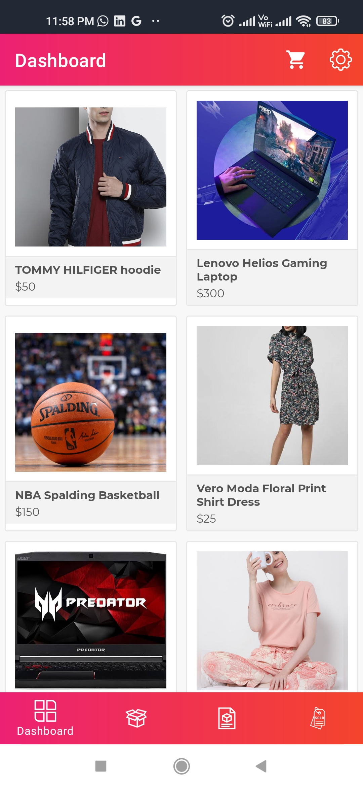
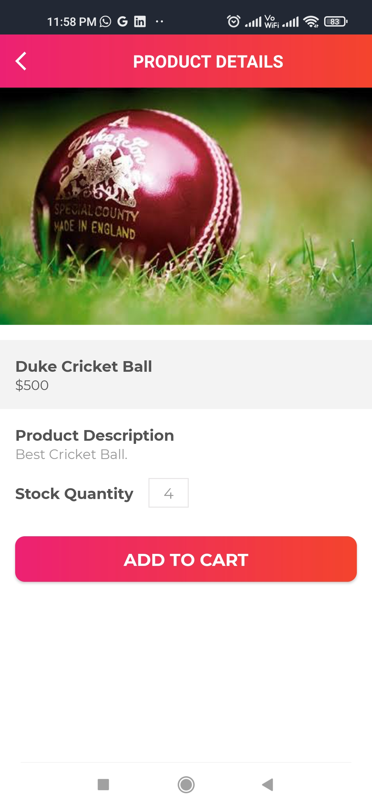
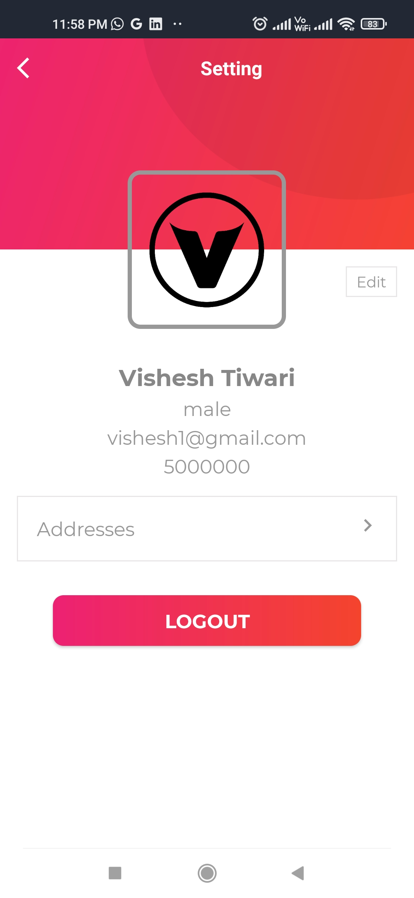
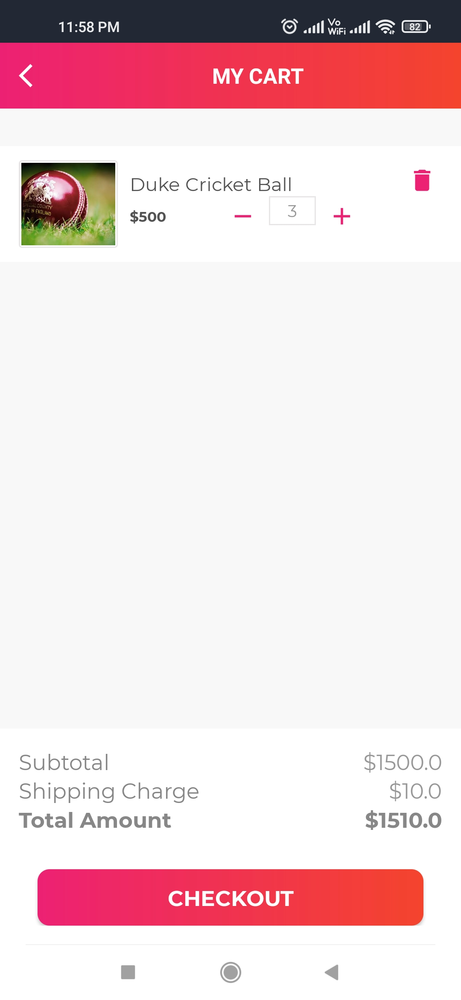
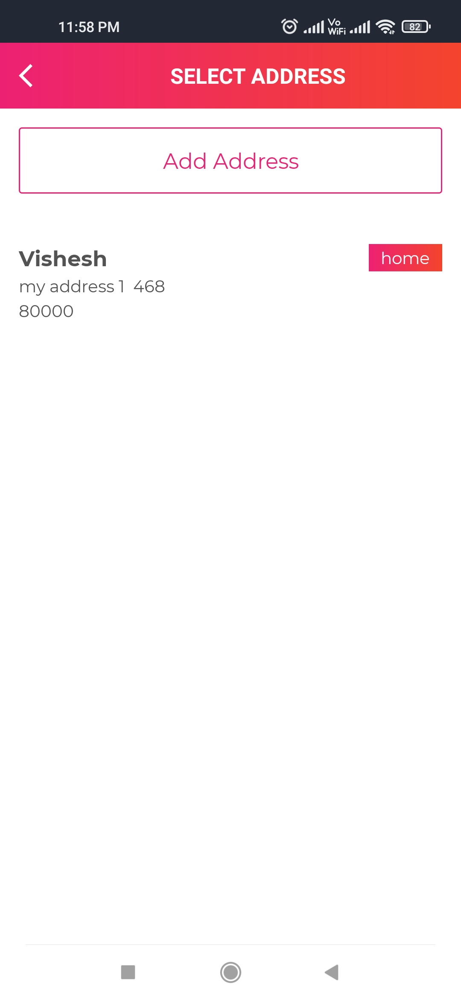
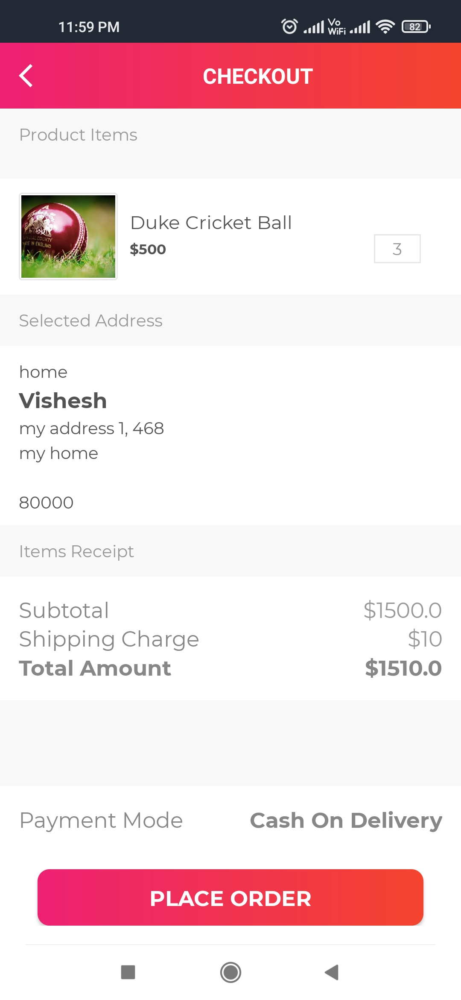
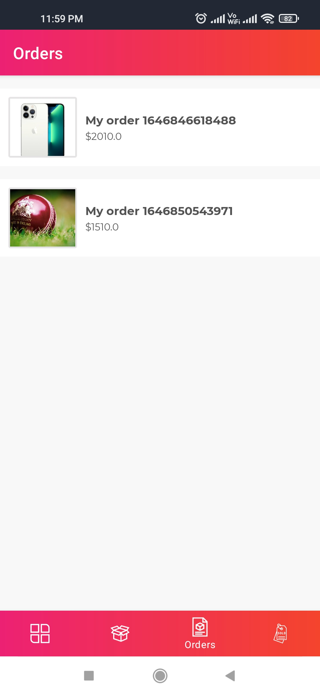
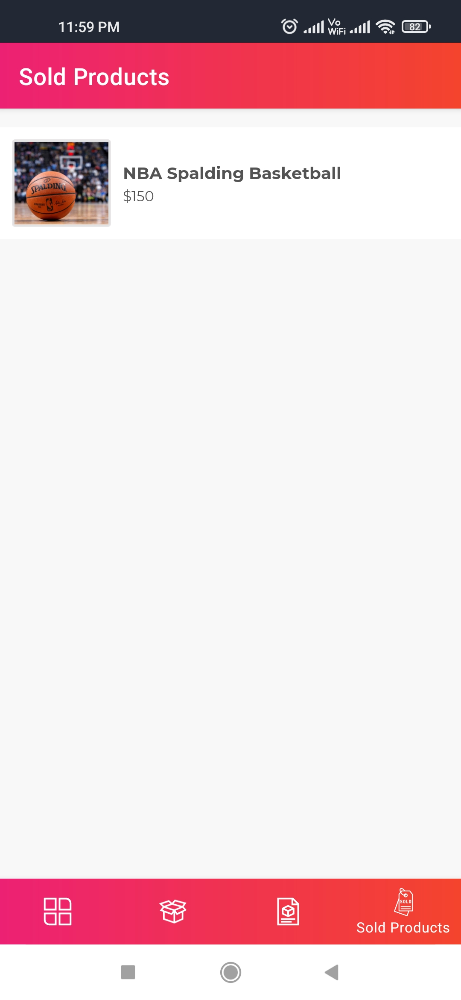

# MyShopPal

**MyShopPal** is an online e-commerce App where you can buy your favourite products. You can add your address in the **Address section** and order the product that you want. MyShopPal also has
a **Prodcts section** where you can add the products that you want to sell with the product image and description. The status of the product you ordered will be displayed in the order
section along with the date when it was ordered, your address where the package will be delievered and the total amount of the order. The last section in the app is  the **Sold products** 
sections which will display your products that have been bought by some other user along with date when it was ordered, name of the user who ordered the product, his address and the total amount.
The app also has a **Cart** which displays all the prducts you have added to your cart, you can increase or decrease the amount product you want to buy in the cart. 

Thank You for reading!

                   

                                                   

                                                  

                               

                              

                              
